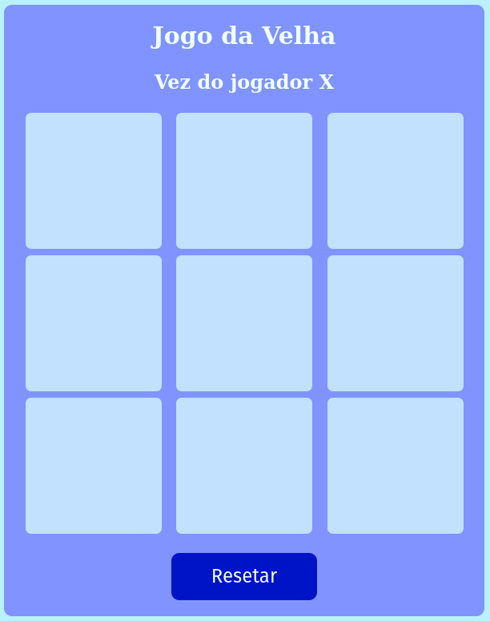

# Tic-tac-toe! :older_woman:

- Welcome to the tic-tac-toe repository, developed by [Lucas Ximenes](https://www.linkedin.com/in/lucasdximenes/). Look at other amazing projects in my [repository](https://github.com/lucasdximenes).

---

## We used the following knowledge when developing this project:

- Programming logic
- Repeat loops
- arrays
- Functions
- Gift and selectors
- Create elements dynamically
- Events

